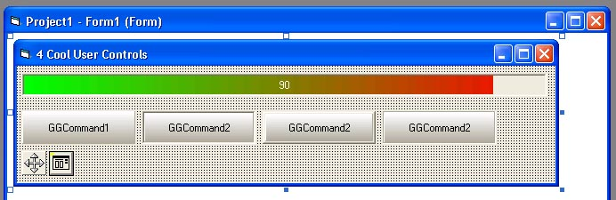



## Four Cool User Controls \- GGCommand, GGProgressBar, GGMover and GGCommonDialog

### Description

4 cool user controls. !!! FOR ADVANCED USERS ONLY !!! NO SAMPLE PROJECT INCLUDED !!! Experiment with Properties Browser and methods and events. Look at the great events of GGCommand (I have not seen a Flat Command Button like mine on PSC yet :)) - MouseEnter and MouseExit. Supports transparent images and Caption and Picture position adjustments.

Usage of GGMover:

In MouseDown events of some object (Picture1 for example - set form and picture1 .ScaleMode to 3-Pixel):

GGMover1.CaptureObject X,Y

In MouseMove event:

GGMover1.MoveObject Picture1,X,Y,True,True,0,300,0,500

In MouseUp event:

GGMover1.ReleaseTargetObject

If you have any problems with these user controls just write me an email to gogox@yahoo com or gogox@lycos.com

This is my first submission to PSC.Enjoy
 
### More Info
 
Be carefull with GGCommonDialog - Set .Flags before using it for Fonts - Use GGCommonDialog1.Flags = cdlCFBoth

             |
---                |---
**Submitted On**   |2002-04-30 16:03:48
**By**             |[Georgi Yordanov Ganchev](https://github.com/Planet-Source-Code/PSCIndex/blob/master/ByAuthor/georgi-yordanov-ganchev.md)
**Level**          |Advanced
**User Rating**    |4.2 (25 globes from 6 users)
**Compatibility**  |VB 6\.0
**Category**       |[Custom Controls/ Forms/  Menus](https://github.com/Planet-Source-Code/PSCIndex/blob/master/ByCategory/custom-controls-forms-menus__1-4.md)
**World**          |[Visual Basic](https://github.com/Planet-Source-Code/PSCIndex/blob/master/ByWorld/visual-basic.md)
**Archive File**   |[Four\_Cool\_78425522002\.zip](https://github.com/Planet-Source-Code/georgi-yordanov-ganchev-four-cool-user-controls-ggcommand-ggprogressbar-ggmover-and-ggcomm__1-34339/archive/master.zip)

### API Declarations

A lot of API's in user control's source code.

